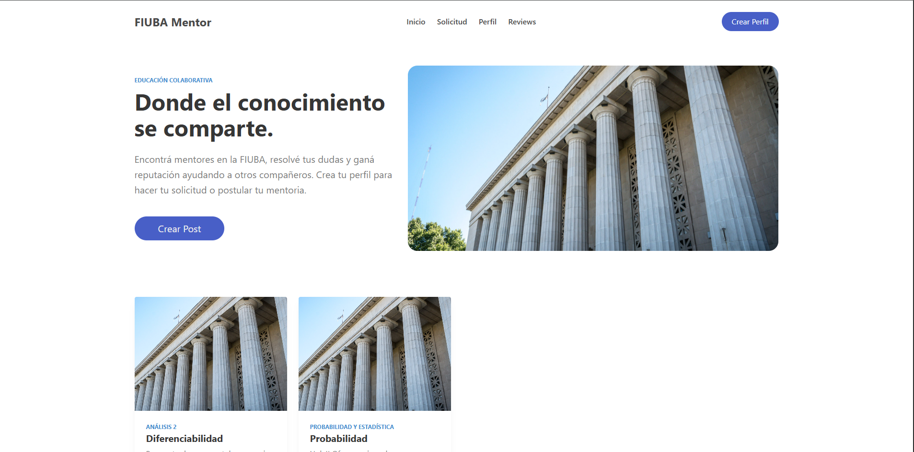
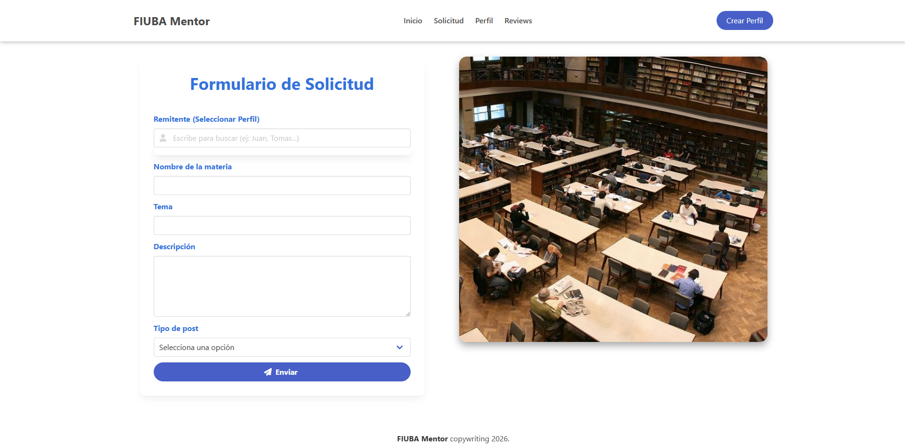
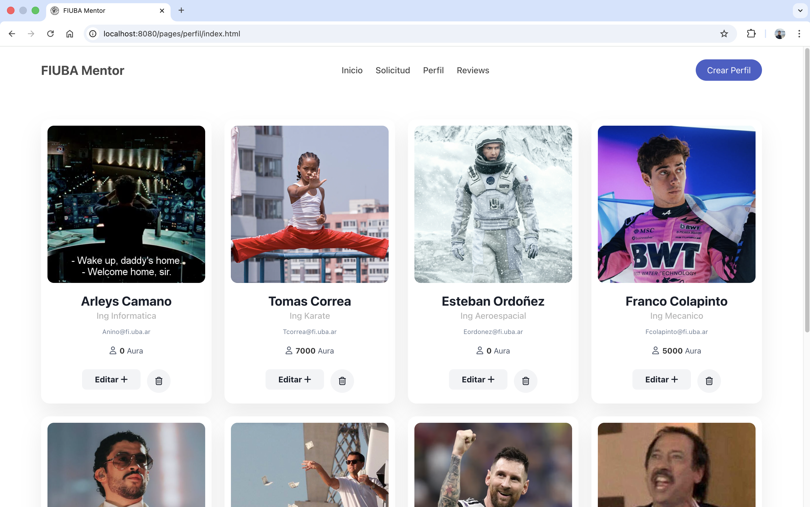
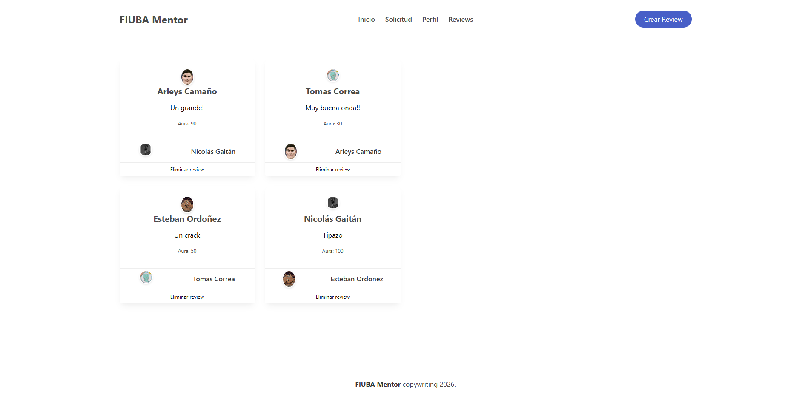

# 🎓 FIUBA Mentor - Mercado de Saberes

> **"Donde el conocimiento genera Aura"**
> Plataforma de intercambio académico exclusiva para estudiantes de la FIUBA.

##  Descripción del Proyecto

**FIUBA Mentor** es una aplicación web que conecta a estudiantes que necesitan ayuda en materias específicas con compañeros dispuestos a enseñar.

El diferencial del proyecto es su sistema de **Reputacion (Aura)**:
* Los usuarios no solo intercambian conocimientos, sino que ganan reputación.
* Al concretar una ayuda (clase/mentoría), el alumno califica al mentor.
* Si la experiencia fue positiva, el mentor recibe **Puntos de Aura**.
* Un perfil con "Aura Alta" destaca en el listado, validando su capacidad académica ante la comunidad.

### Requisitos Cumplidos
* **Persistencia:** Base de datos relacional (PostgreSQL) con 3 entidades y relaciones.
* **Arquitectura:** Backend (API REST) y Frontend (Sitio Estático) separados.
* **Infraestructura:** Despliegue containerizado con Docker Compose.
* **Metodología:** Uso de Git Flow y Code Reviews.

---

## 👥 Equipo de Desarrollo

| Nombre y Apellido | Legajo | Rol Principal |
|-------------------|--------|---------------|
| **Nicolas Gaitan** | 113347 | Dev front
| **Tomas Correa** | 113878 | Dev front
| **Esteban Ordoñez** | 112981 | Dev front back-Db 
| **Arleys Camaño** | 114432 | Dev front back-Db


##  Stack Tecnológico

El proyecto utiliza una arquitectura moderna y escalable:

* **Frontend:**
    * HTML5 Semántico.
    * **Bulma CSS Framework** (Diseño Responsivo y Componentes UI).
    * JavaScript (Vanilla/ES6) para consumo de API.
* **Backend:**
    * Node.js.
    * Express.js (API REST).
* **Base de Datos:**
    * PostgreSQL 17.
* **Infraestructura:**
    * Docker & Docker Compose.
* **Control de Versiones:**
    * Git & GitHub.


##  Modelo de Datos

El sistema cuenta con **3 entidades principales** diseñadas para cubrir el ciclo completo de aprendizaje:

1.  **Usurs:** Usuarios del sistema con sus datos académicos y puntaje de *Aura*.
2.  **Solicitudes:** Ofertas ("Enseño") o Demandas ("Busco") de materias específicas.
4.  **Reviews:** Calificación final de la experiencia. Esta entidad cierra el ciclo y dispara la actualización de los puntos de *Aura*.

##  Instrucciones de Instalación

Siga estos pasos para levantar el entorno de desarrollo localmente.

### Prerrequisitos
 Tener instalado [Docker](https://www.docker.com/) y [Docker Compose](https://docs.docker.com/compose/).

### Pasos
1.  **Clonar el repositorio:**
    ```bash
    git clone https://github.com/Nico-Gaitan-FIUBA/TP-2-Intro.git
    cd fiuba-mentor
    ```

2.  **Levantar los contenedores:**
    Ejecutar el siguiente comando en la raíz del proyecto:
    ```bash
    docker-compose up --build
    ```
    *Esto descargará las imágenes de Postgres y Node, e inicializará la base de datos con el script `database/init.sql`.*

3.  **Acceder a la aplicación:**
    * **Frontend:** http://localhost:8080 (o abrir `Frontend/index.html` según configuración).
    * **API Backend:** http://localhost:3000.
    * **Base de Datos:** Puerto 5432 (Usuario: `postgres` / Pass: `postgres`).


##  Flujo de Trabajo (Git Workflow)

Para el desarrollo se utiliza una estrategia de ramas basada en funcionalidades (Feature Branching):

1.  La rama `main` contiene solo código estable.
2.  Cada nueva funcionalidad se desarrolla en una rama propia: `feature/nombre-funcionalidad`.
3.  Se utilizan **Pull Requests (PR)** para integrar cambios.
4.  Todo PR debe ser revisado y aprobado por al menos un compañero antes del merge.


##  Capturas de Pantalla

### Inicio




### Solicitud



### Perfiles



### Reviews 



> Proyecto realizado para la materia **Introducción al Desarrollo de Software** - FIUBA, 2026.
